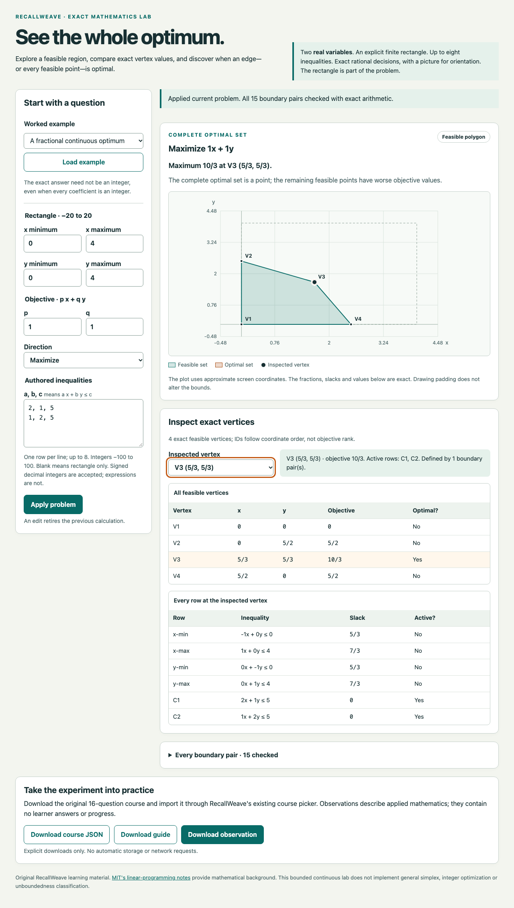

# LP Explorer: installed Mac package and actual receiving

The original RecallWeave linear-programming explorer, lesson and guide are installed at:

`/Users/me/Applications/RecallWeave-LP-e3a41d2b3368`

The package has **14 files totaling 212,564 bytes**. Its six new helper files provide an integrity-checking macOS entry and a complete recovery carrier. The original three product assets remain byte-identical to commit `b5e46d4f8c3013259c0baa81507652d900cb5074`.

**Installation and author controls passed; the two actual installed launcher checks passed. A separately corrected continuation then passed the four remaining installed-browser groups. The first browser attempt remains FAILED overall.** Its completed L1 is carried as original evidence, with zero new launcher invocations in the continuation.

## Use the installed package

Open **Open LP Explorer.command** in the installation above. It verifies the package and asks macOS to open the exact installed HTML file in the usual browser. The installed [user guide](../../../tools/local-lp/README.md) explains examples, explicit downloads, checks and separate-copy recovery.

For the demonstrated example, choose **A fractional continuous optimum**, select **Load example**, and inspect **V3 (5/3, 5/3)**. The result is an exact maximum of **10/3**. The page offers separate observation, course and guide downloads.

The demonstrated browser receiving used a new private headless Chrome and the exact installed file URL. The normal macOS dispatch branch has source and controlled-spy coverage; actual Finder/default-profile use was not part of these checks. The installed launcher itself was genuinely executed twice with its non-opening flags.

## Qualification by actual epoch

| Work | Actual result and evidence |
| --- | --- |
| Source placement, first attempt | Refused before writes because the frozen raw calendar boot-time tuple differed. Native PID 51183 exited 3. The failure is retained. |
| Source placement after identity amendment | PID 66415 exited 0. Six exact source files were placed. Existing Node 26.3.0 was observed once; runtime/source pins remained exact. |
| Positive installation | Installer PID 74198 exited 0. The installation marker was written last after verification. Original raw receipt and all installed identities are retained. |
| Five author controls | Native in-process returns were `[2,2,2,0,2]`, with dispatch-spy calls `[0,0,0,1,0]`. Carrier tamper, existing destination, missing marker, valid dispatch intent, and installed-asset tamper behaved as frozen. These were five in-process control calls, not five operating-system processes. |
| V1 L1: installed entry | Actual executable `--check` PID 99091 and `--no-open` PID 99096 exited 0. Each verified the package without requesting a browser open. |
| V1 browser epoch | Overall FAILED at preset selection. The page loaded, but Home/ArrowDown/Enter left `#preset` at `unique`. Enter caused a trusted Apply click and form submit. No Load example, fractional application, download or screenshot occurred. |
| V2 L2: fractional use | PASSED. One native printable prefix per select chose the fractional example and displayed optimum. Exact result, fields, four feasible vertices, fifteen boundary pairs and selected vertex were observed. |
| V2 L3: physical downloads | PASSED. Three trusted visible-button clicks produced three completed Browser GUID files. The full observation oracle passed; course and guide bytes match the originals exactly. |
| V2 L4: reopen | PASSED. The used tab closed; a fresh tab at the same installed URL showed the original `unique` example and zero local/session storage entries. |
| V2 L5: preservation and closure | PASSED. Complete installed/source/runtime and prior-evidence inventories conserved. Chrome and its tracked groups closed. The final scoped census was empty; the outer Node was reaped with its group absent. |

The original broader solver, course and browser qualification remains in [the existing LP contribution](https://github.com/Jacob-Met/RecallWeave/issues/174#issuecomment-6071314227). This local package work reused that evidence and did not repeat its complete mathematics/application campaign.

## The actual continuation

The final receiver used source `0f654871b830adf7e41d4243a9935cf9dd9a0ce7`, plan `134d66dbf1ceb54b8e87b857b81fc3405ace70c0`, root supervisor `47fc67f44906a83a54dec9f6b55f051f3163f612`, and bounded transport bootstrap `181ab48d3b38d9c9b2dd91e0c72c662728bc9eea`.

It ran on 2026-10-09 from **07:49:32.752555 to 07:49:34.806273 UTC**:

| Process | Recorded outcome |
| --- | --- |
| Native supervisor PID 41907 | Exit 0; tool-reported runtime 3.50 seconds |
| Node PID 41984 | Exit 0; measured child wall time 1.9850264999549836 seconds; reaped; its process group absent |
| Chrome PID 41991 | Exit 0; started 07:49:32.982 and finished 07:49:34.671 UTC; created group retired after terminal and empty scoped census |

These are distinct measurements, not interchangeable timing claims.

The fresh admission observed **12,012,290,048 bytes** of free + inactive + speculative memory and **738,250,752 user-available disk bytes**, above the original 2 GiB and 256 MiB floors. It matched the same Darwin account, hardware UUID and stable kernel boot-session UUID, and exact Python/Node/Chrome/Chrome-plist identities.

The source and installed package were preserved. Root losslessly compared **14 installed files, six source files, four runtime files, fifteen prior evidence files and five new staged source files** before and after use. The inner receiver additionally checked the complete four-directory installation and eleven pinned prior files.

The new continuation tree measured **3,302,805 bytes** before its final **55,386-byte** supervisor receipt, giving **3,358,191 bytes** afterward. Together with a conservative **4 MiB reservation** for the sealed first epoch, the composite accounting value is **7,552,495 bytes**, below 64 MiB. This uses the original closed epoch's sealed measurement; it is not a new scan of its profile/tmp.

### Actual downloaded files

| Button / suggested filename | Bytes | Git identity |
| --- | ---: | --- |
| [Observation JSON](native/continuation-v2/downloads/linear-programming-observation.json) | 7,194 | `a18d25bc4e9b334d861528a22c11d60ca7c5da1a` |
| [Original course JSON](native/continuation-v2/downloads/linear-programming.json) | 13,211 | `626390853e90df96de34f061e7a4f5114c36d067` |
| [Original guide](native/continuation-v2/downloads/linear-programming.md) | 8,028 | `717653e782acd1d23113117d70cdc7c0a5cd301b` |

The receipt records the actual GUID paths, frame identity, byte counts, SHA-256 values and completed download events. These files were read from the actual completed native downloads. The observation was not regenerated to satisfy the receiver.

### Native input correction and retained failures

The exact observed Chrome version was **154.0.8037.99**, revision `45889d77830582727fe00dbfd614bcb7aac35caa`. Primary Chromium source at that revision shows Mac select-menu behavior that invalidated the original Home/index-arrow/Enter assumption. The correction uses printable typeahead through native CDP `rawKeyDown → char → keyUp` events. It preserves trusted input/change evidence and the actual final selection.

The first proposed prefix `A f` matched both **A fractional continuous optimum** and **A feasible segment**. Exact source inspection caught that before native continuation use. The [unique-prefix amendment](contracts/unique-prefix-amendment.json) was sealed before changing the receiver to `A fr`. The initial `c9438eae…` draft remains source-only.

The final continuation sent four trusted preset keypresses (`A fr`) and two trusted vertex keypresses (`V3`). It observed one Load example click, three download clicks, zero Apply clicks and zero form submits. It made no DOM value assignment or direct application-handler/solver call.

An earlier unexecuted supervisor `6789249e…` was tightened before use to enforce runtime mode, owner and Git identity alongside the existing byte/hash/time/device/inode checks. Its draft and transport remain available. The final source and plan passed [independent source review](reviews/continuation-source.json) before the native invocation.

### Closure observations

The continuation's page/console errors, outside page requests and active protocol errors were zero. Its original receipt also retains:

- Browser.close intent at **07:49:34.557 UTC**.
- One websocket error at **07:49:34.623 UTC**, observed after that intent.
- A websocket close event at the same time with **code 1006** and **wasClean: false**.
- Native Chrome stderr with the allocator and CVDisplayLink diagnostics.
- Separate terminal/empty evidence for the created Chrome and tracked groups.

The phase labels establish observation ordering. They do not establish the cause of the transport event or make the connection close clean. The V1 websocket error has no timestamp/phase and remains unqualified; the later observation is not applied retrospectively.

The existing shell-startup conda/libarchive warning is retained in native tool transport. The explicitly pinned Python successfully ran; no global environment repair was attempted.

## Screenshot receiving

Root viewed the original **1280 × 2259** capture. The exact optimum, selected vertex, polygon, four-vertex table, six-row slack table and three download controls are legible without overlap or cropped content.

The **305,051-byte** PNG has SHA-256 `c154d85c73a64b2e360cf8f855df9a04f8ffe714b35c6108c5b49087426f875b` and Git blob `ad4df19eb9dd7527a96f28e000340c56ae6876dc`. Its native read matched all three pins and Git creation returned that exact identity.

Both enabled Git fetch tools reject binary UTF-8 decoding. The [ASCII base64 companion](native/continuation-v2/fractional-installed.png.b64) therefore supplies a complete text readback of those exact original bytes. The original native image was not edited. The root result records the initial local stdin receiving refusal and the subsequent bounded raw-PTY hash check, both after the native browser had already closed.

## Evidence and recovery

Start with [INDEX.json](INDEX.json), [the root result](ROOT-RESULT.json), [V1 findings](native/receiving-v1/FINDINGS.md), and the original raw [V2 receiver](native/continuation-v2/RECEIPT.json) / [V2 supervisor](native/continuation-v2/SUPERVISOR-RECEIPT.json) receipts. The index lists complete byte counts, SHA-256 values, Git identities and any actual download origin.

The packet contains pre-code contracts, source reviews, original controller/receiver source, exact plans and reproducible plan inputs, immutable native receipts, literal captured streams, physical downloads, and the screenshot. Original JSON and stream bytes are preserved rather than reserialized. Native nanoseconds were compared with Python integers or retained decimal strings.

The actual installed `recovery/` folder holds all six helper sources and the fixed asset carrier. A new destination can be installed separately through the documented installer. Existing destinations and partial prior folders are refused; this workflow performs no cleanup or replacement.

This packet concerns one explicitly installed local package. It establishes no new shared service, Commons/Hub binding, default profile adoption, physical keyboard use, learner progress migration or deployment. Source publication uses the owned non-triggering branch after a fresh workflow/ref/PR/rules check; no PR, default-branch update or Actions execution is part of this work.
