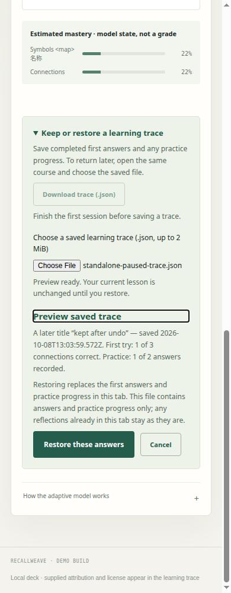

# Current learner importer: authored file and completed-trace receiving

**Accepted for the tested consumer flow on the merged importer runtime. No application patch was needed.** This packet records 13 real browser receiving groups against the final public PR #33 source. It adds independent evidence; it does not change the importer or take over source integration.

## Exact source and merge correspondence

| Pin | Value |
| --- | --- |
| Accepted PR #33 head | `7f517150ca828045a5f461e8d5bfc13c2f5821d2` |
| Accepted-head tree | `dcbb6ba119b8807c055bb2d92b6fcbcc971ae27c` |
| Actual PR #33 merge | `d8a9ff81e8e5290e8daad5b4af957d4eddc0ee74` |
| Actual merge tree | `2d6b3849fe9efe0d38f8c3cd62588fb9477d328d` |
| Merge first parent | `a06c3c8702774c02906281f0b631bc8263f2d7a7` |
| App SHA-256 | `ea0926d962c23715ae885d81f1ab2075b3598692393210197e357bb88f18a7bb` |
| Final standalone SHA-256 | `d0819e8630ff119be2c078408907ab53e3725999c8fdf71d35deb7f230d3bcd9` |
| Final bundled data SHA-256 | `28204e412703fb3f143ebcaf0770e0eb6116a2c8c09c9a68a1b0ef873f95cc16` |
| Tested receiver SHA-256 | `90de9283e7ace12ddbc562b01761c261702e918cf8e9d5d6bc2c15320df44ab6` |
| Raw final browser receipt SHA-256 | `14afb7ba71185d3358ebf0be2fab8dac46949913bfe5caf2941d9528f5a27519` |
| Source manifest SHA-256 | `31c395ce32394e364a9b7af060c1a856cc05fc1b672886cb155fe923edc22054` |
| Merge correspondence SHA-256 | `40893cb9452efb47462540719a170acc2ab32c650f4ae06c86a77f5efe9c379d` |

All 14 learner runtime/build files were fetched from the accepted public head, verified against GitHub's exact Git blob hashes before writing, and matched their modes and blobs in the actual merge tree. The complete accepted-head and merge trees differ because main advanced before the merge. [merge-correspondence.json](merge-correspondence.json) deliberately claims only the tested runtime/build correspondence. Root retains whole-source integration review.

The 14 files are the nine imported learner modules, index, stylesheet, bundled course, standalone builder and actual standalone artifact. They are sufficient to execute both learner entrypoints and check standalone generation. Their before/after hashes remained identical during the run. Native syntax and `python3 source/tools/make_demo.py --check` passed.

The importer owner remains `estate-490fcd7c4056/root`, under [issue #7](https://github.com/Jacob-Met/RecallWeave/issues/7) and [merged PR #33](https://github.com/Jacob-Met/RecallWeave/pull/33). The receiving owner is `estate-49f845d0dece/recall_import_receiving`, continuing [the original offer](https://github.com/Jacob-Met/RecallWeave/issues/7#issuecomment-6058987247). The offline author is credited at PR #16 head `66da3a4af752a9b57a6366e66a5d9438fc277587`; trace source is credited at PR #14 head `bd63e0677b24c3613c1189cf2995fedc87459457`.

## Actual authored file and completed consumer path

The input is the actual PR #16 browser-authored [authored-final.json](inputs/authored-final.json), 1,642 bytes, SHA-256 `6b6aafa39048d22be31a8d3221bce5e6ba320e3754de447a88e02b5953a7b0a9`. It was retrieved from the original author qualification directory at the exact author head. Its three questions include reordered IDs, nonzero canonical correct answers, renamed concept/prerequisite references and literal Unicode/markup text. It is synthetic software-receiving content.

On v22.22.1, Linux x64 and Chrome/154.0.8037.57, the final run executed from 2026-10-08T13:03:54.481Z to 2026-10-08T13:04:00.793Z. The modular page ran through an isolated loopback static server at 1,280 px. The exact final standalone ran through `file://` at 390 px. Both used clean browser state and the native file-input implementation, driven through CDP `DOM.setFileInputFiles`; existing controls were activated with the keyboard.

Each entrypoint passed these six receiving groups:

1. An answered bundled lesson survived actual authored-file staging and preview, preview cancellation, an empty file-input selection and invalid JSON refusal. The real authored prompts and supplied metadata appeared without becoming markup.
2. Explicit start created a fresh imported lesson. All three authored questions followed the native model's chosen order, displayed canonical option values correctly under shuffled letters, and produced an actual completed first-session trace download. Literal Unicode and markup remained text in feedback and review.
3. The learner practiced one missed question, paused at the trace, and downloaded actual JSON and study notes. The first answers and full-precision model estimates stayed unchanged, and the canonical retry appeared separately.
4. A new browser document refused the saved trace against its default bundled course. Reimporting the same actual authored file and explicitly starting it enabled trace preview. Preview, cancellation and tampered-mastery refusal preserved the new lesson until explicit restore.
5. Explicit restore produced the exact saved course/model/first-answer/mastery/practice state. A new actual download proved that round trip, allowing only the new save timestamp to differ. Practice resumed at the next unanswered question under a different displayed option order, and final trace/notes downloads preserved the first-session record.
6. Starting a fresh import invalidated a staged restore. A named trace read delayed across an explicit course switch could not revive the old preview or replace the new lesson.

A final shared group verified no script exceptions, no hosted application requests and unchanged source hashes. Twelve actual downloaded files and eight screenshots are preserved. [final/browser-report.json](final/browser-report.json) is the raw report.

| Question | First canonical choice | First result | Original display order |
| --- | ---: | --- | --- |
| question-2 | 3 | Miss | 1, 2, 3, 0 |
| question-10 | 0 | Correct | 1, 0 |
| question-13 | 0 | Miss | 1, 2, 0 |

The fresh document displayed question-2 in canonical order 0, 1, 2, 3 and resumed question-13 practice in order 0, 1, 2. The saved first choices remained canonical. The first retry corrected question-2; the resumed retry intentionally missed question-13. Both first-answer mastery estimates remained exact throughout.

## Evidence and negative results

[final-native-receiving.tar.gz](final-native-receiving.tar.gz) contains the exact 14-file public runtime snapshot, tested receiver, input, complete final browser run, all real downloads and screenshots, stdout/stderr, native exit receipts and the two Mac navigation attempts with their original receiver revisions. Disposable generated browser-profile caches are omitted; all assertion and failure evidence is retained.

The final run used the existing native Chrome for Testing executable at `/home/jacob/.cache/puppeteer/chrome/linux-154.0.8037.57/chrome-linux64/chrome` and a short private receiving directory, `/tmp/rw49-pr33-49f845d0dece`. No browser or dependency was installed. No other owner's directory, branch or source was modified or cleaned.

Two earlier Mac attempts reached the Chrome CDP endpoint but timed out at the first `Page.navigate` before any application assertion. A separate Node loopback preflight returned the exact index file with HTTP 200, and a bounded longer navigation wait repeated the same pre-app timeout. Root identified the same historically retained Mac receiving boundary. These are preserved as environment/harness failures and are not labeled importer failures. The successful ThinkPad run used the original application assertions; the only change from the already-successful earlier-composition receiver was its explicit final-source provenance.

The [earlier exact 4775-composition packet](https://github.com/Jacob-Met/RecallWeave/blob/9286c045a989a9b34ade57e7ee5e95d3a248aeb7/docs/receiving/authored-import-trace-49f845d0dece/README.md) remains unchanged. It retains its own 13-group Chromium153 run, staging refusal, notes timestamp expectation failure and startup delay. This final packet does not relabel that evidence. The newer bundled course and standalone were actually exercised here.

## Instrumentation and limits

Only two controlled hooks are used in the successful browser run: `Math.random` is fixed to 0 and 0.999999 in the respective documents so the changed option permutations are reproducible, and one named trace's `File.text` promise is delayed for the course-switch case. No deck, answers, mastery or practice state is injected; those enter through the actual file input and learning controls. Notes are compared exactly using their actual downloaded `Saved` timestamp.

Preview cancellation and empty native file-input selection were exercised. OS chooser cancellation was not. Reflection and unfinished-lesson hooks are outside this receiver's scope and absent from this tested snapshot. The packet qualifies the authored-file and completed-trace consumer on the exact merged runtime, not unrelated incoming courses, authoring tools or efficacy. It uses synthetic local data and makes no claim about live learners, accounts or deployment.

## Reproduce

Obtain the exact public PR #33 source at the head or merge identified above. The included [receive-authored-import-trace.mjs](receive-authored-import-trace.mjs) starts its own loopback server and clean browser and writes a new evidence directory:

```sh
node receive-authored-import-trace.mjs --root /absolute/path/to/RecallWeave --input /absolute/path/to/authored-final.json --output /absolute/path/to/new-empty-receiving --browser /absolute/path/to/chrome
```

Keep the original report untouched. A later source needs a separately preserved receiver revision with the new provenance labels and its own output directory. The native durable packet is at `/home/jacob/recallweave-import-pr33-receiving-49f845d0dece` on ThinkPad. Raw Mac attempts remain at `/Users/me/workspace/estate/estate-49f845d0dece/recallweave-import-pr33-receiving`, and are included in this archive.




