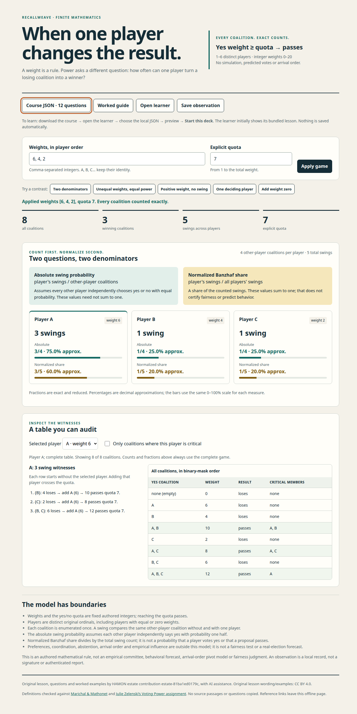

# Coalition power: when a weight changes the result

An original twelve-question, four-concept lesson and finite offline explorer. It enumerates every yes coalition for one to six distinct players, shows critical members and swing witnesses, and keeps absolute swing probability separate from normalized Banzhaf share.

[Download the portable folder](offline/coalition-power-offline.zip), extract it and open `START-HERE.html`. Explore → download Course JSON → open the unchanged learner → choose the local course → inspect the preview → **Start this deck**. The learner initially opens its bundled lesson. Observation JSON is a different format and is not a learner course. Nothing is saved automatically.

The portable ZIP is **49,657 bytes**, SHA-256 `0032bad8f7ea4ed28d80d020012ea7ab8de6160670632d8328bbbe8db9b816be`. Its six files need no Git, server, account or installed dependencies. Exact file identities and completed receiving are in [the portable manifest](offline/manifest.json).

## Source and receiving

Nine new product paths are bound to native partial-history commit `9868902b63e99eb798ad9946f32dfed4028ffd4c`, tree `189b4c67ab31317edc4d861f5b60afbc063af0fe`. This native history imports only the exact 35-file original closure; it is not canonical repository ancestry. The complete canonical source base is `698902f9c9c1d5c5023092b85b3632a7cb7a01ed`, tree `d6d3707b691850af7928299242631534cff89aa8`. Every existing learner, catalog, README, workflow and other topic is preserved.

Receiving used the existing native Node 22.22.1 and Chromium 153, with a fresh private profile, network offline and the normal browser sandbox:

- 12 original learner-parser tests and 11 focused author tests passed.
- A separately frozen oracle passed seven groups, including all 1,878 positive-quota games with one to four players and weights 0–3, covering 27,084 coalition rows. It also checked named edge cases, ordinal permutations, strict refusals and nested-result isolation.
- Twelve independently solved question answers were frozen before the keys were exposed. All keys, explanations, twelve guide transfer answers and probability assumptions were then reviewed.
- The first actual browser run passed 14 groups and seven exact disk downloads, including the complete 64-row PDF, mobile layout, extracted-folder routes and unchanged learner chooser → preview → explicit Start.
- Direct screenshot inspection then found an overly broad CSS focus selector. The exact one-selector correction was received in two focused browser groups with two further exact downloads. Final keyboard focus belongs to exactly one control. The corrected HTML recovers the first received HTML byte-for-byte when that selector is reversed; the core, course, guide and UI logic never changed.
- A separate package reviewer checked all six archive members, unchanged source identities, embedded course/guide bytes, wording and relative routes, then accepted the final two-file package delta.

[Qualification](qualification.json), [source manifest](source-manifest.json) and the [native receiving archive](native-receiving.zip) retain the exact drivers, artifacts, independent freezes, reviews and negative progression. The archive is **2,614,291 bytes**, SHA-256 `54e7dbeab17cceb8f6590220c285b88bebb57f007d605601996e6dd402587d51`; all 107 members were reopened and hash-verified against [its manifest](native-archive-manifest.json). A verified Git bundle is inside that archive.

Native copies and an extracted usable folder are also retained through the estate's existing intake; [custody receipt](native-custody.json) records their exact paths and readbacks. Home-volume ENOSPC and the small receiver-assembly guard failure are preserved, with no inferred success or unrelated cleanup.

## Integration boundary

This is qualified native source and a portable delivery. PR/main integration and hosted deployment are not claimed. The user-directed no-Actions boundary is preserved: no workflow is changed, no run is dispatched, and no PR or main mutation is part of source retention. Any feature ref is admitted only against the unchanged full workflow definitions, which trigger on PR or push to main.

The model is not a behavioral forecast, arrival-order pivot model or fairness judgment. The original course and guide credit their mathematical references and license original wording/examples under CC BY 4.0.
