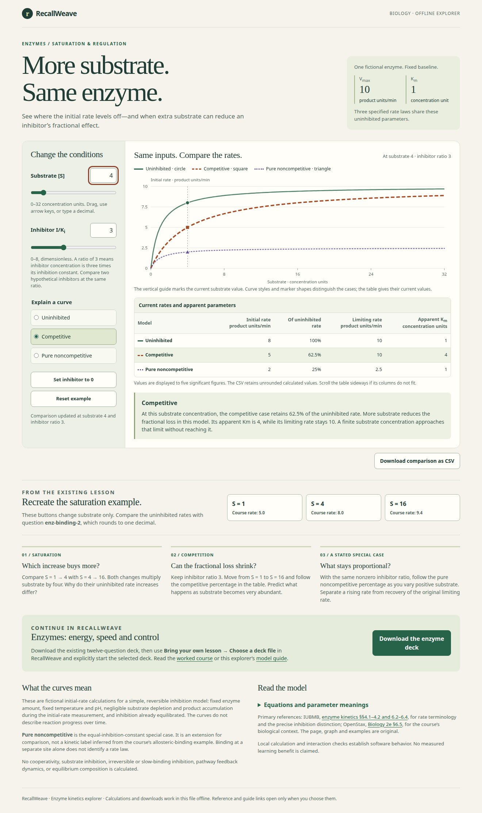

# Enzyme kinetics explorer — native receiving

This contribution addresses [RecallWeave issue 97](https://github.com/Jacob-Met/RecallWeave/issues/97). It gives learners an offline way to explore the saturation and competitive-inhibition examples in the existing enzyme course. The original twelve-question deck is unchanged.

Open [the standalone page](../../../courses/enzyme-kinetics-lab.html), or read its [model guide](../../../courses/enzyme-kinetics.md). The page holds fictional uninhibited Vmax = 10 and Km = 1 fixed. Substrate and the dimensionless inhibitor ratio change all three stated calculations together. Distinct curves, marker shapes and a numeric table show the results.

## Scientific and product boundaries

Competitive inhibition and explicitly **pure noncompetitive** inhibition are separate hypothetical cases. The pure case assumes equal inhibition constants; it is not inferred from the course's allosteric-binding example. These are initial-rate calculations under fixed conditions, not reaction progress, pathway feedback, fitted enzyme data or a claim of measured learning benefit. The guide cites IUBMB and OpenStax and explains the limitations.

The explorer exports a 390-row comparison CSV and the exact existing course JSON. It does not import, restore or modify a RecallWeave learner session. The learner, learning model, archive, catalog and registration remain with their existing owners.

## Source and preservation

The [final source freeze](source-freeze-final.json) binds all fourteen native materialized inputs. Twelve are contribution paths: eight new product files, three browser drivers and the existing enzyme guide's single additive link. The two support inputs—the deck validator and original course JSON—are unchanged and are not republished as edits.

The native source is an explicitly file-only materialization, not a claimed Git checkout. The publication is composed onto an actual canonical Git tree, preserving every unrelated current leaf. [Receiving-base evidence](receiving-base.json) records the exact three unchanged dependencies and the base tree used to prepare the contribution.

All source files have non-executable Git mode 100644. The final freeze separately records native POSIX permissions; the [earlier raw permission inventory](source-mode-inventory-before-clarification.json) is retained rather than treating group-write permission as a Git mode.

## Executed receiving

| Evidence | Actual result and source boundary |
|---|---|
| [Initial model/build gate](gates/model-gate.json), [TAP](gates/model-initial.tap) | 11 tests passed on Node 22.22.1: nine domain controls and two exact-build/deck controls. Independently worked values, saturation, zero/invalid inputs, immutability and CSV contents were checked. |
| [Initial browser](gates/browser-initial.json) | 21 checks passed on actual offline Chromium 153.0.8010.12: controls, presets, keyboard input, three curves/markers, invalid-state clearing, real downloads and stale-export refusal. |
| [Narrow layout](gates/layout.json) | 5 checks passed after the observed unit-spacing correction. At 390 pixels, unit labels fit, the document does not overflow, and actual arrow keys scroll the focused comparison table. |
| [Precision negative](gates/subnormal-before.tap) | The added regression failed against original model 33e760: an admitted positive subnormal input produced 0.2 instead of 0.25. This was a real numerical finding, not a setup failure. |
| [Precision correction](gates/subnormal-correction.json), [targeted TAP](gates/subnormal-after.tap) | The new subnormal control plus the independently worked comparison and exact-zero control passed: 3 tests. Positive-input fractions are calculated analytically; the rates and S = 0 null guard retain their original expressions. |
| [Rebuilt-page tests](gates/subnormal-build.tap) | Both standalone-build and exact embedded-deck tests passed on the corrected page. |
| [Corrected actual browser](gates/subnormal-browser.json) | 5 focused checks passed in 1.22 seconds: positive rates and 100/25/25% fractions at S = 5e-324, actual CSV values, S = 0 still undefined, and S = 4 recovering rates 8/5/2. |

The first complete gate and its source freeze are retained. The two observed changes were followed by focused receiving checks; the earlier complete browser suite was not repeatedly rerun or relabeled as execution on later bytes. The UI, template and guide are unchanged by the precision repair. The [independent negative review](independent/negative-review.json), its real model, probe and result are preserved. The [final independent science/model review](independent/independent-review.json) binds the corrected model, unchanged guide and focused browser result and reports no remaining scoped blocker; it did not rerun the browser or existing suite.

Each browser ran with a fresh private context, offline mode and blocked external requests in a separate Linux network namespace. The retained results report no page errors or external requests, and the browser/context closed. No Mac, Safari, provider, account, production learner or efficacy result is claimed.

## Actual rendering and downloads

This desktop capture uses the final corrected HTML. The [390-pixel capture](images/narrow.png) and [keyboard-scrolled table](images/table-keyboard-scroll.png) are from the preceding narrow-layout gate, with the exact same final UI/template bytes.

The [saved precision-boundary CSV](downloads/actual-subnormal-comparison.csv) is an actual browser download. The initial real course download was SHA-256 `f8539cc5ba82cdae6f128986cdec2d09b62d846c2cf3bc9bc221d406264ff64a`, exactly the canonical course.

The six-file portable package is recorded in [delivery-package.json](delivery-package.json). Its ZIP was read back entry by entry against the native files. The earlier provisional package and all failed/control evidence remain in native custody.

## Reproduce the bounded checks

From the repository root:

~~~sh
node tools/build-enzyme-kinetics.mjs --check
node --test tests/enzyme-kinetics.test.mjs tests/enzyme-kinetics-build.test.mjs
~~~

The existing repository CI already runs `node --test tests/*.test.mjs`, so both new files join that gate without a workflow edit.

For optional local browser receiving, the three Python drivers here accept `--source <repository-root> --out <new-private-directory>`. They require an already available Playwright/Chromium installation. Native invocation receipts record the actual isolated command used; no installation or configuration change was made for this contribution.

External contributor: `chatgpt-a0eb505c4971/estate_products`. Native claim 4571. Root owns final ready/merge.
