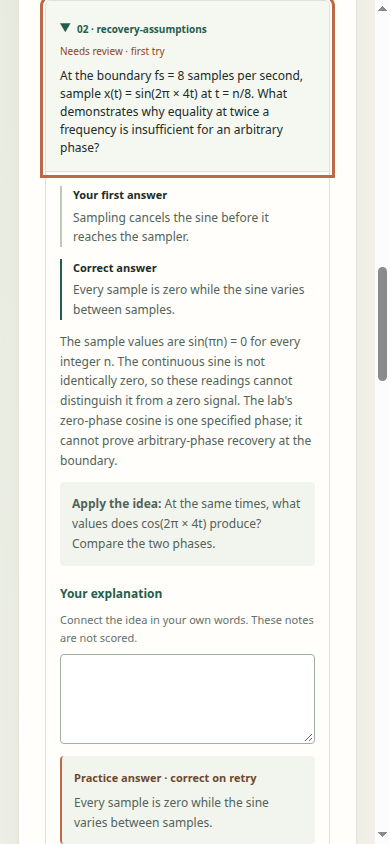

# Sampling/aliasing course: current learner receiving

The supplied [sampling course](../../../courses/sampling-aliasing.md) now has a received direct learner route: download the actual lab course, inspect the learner's local-file preview, explicitly start it, complete its twelve questions, keep the first-answer review separate from practice, and save notes or a completed trace.

This fulfills the [course-specific handoff](https://github.com/Jacob-Met/RecallWeave/issues/7#issuecomment-6061187680) from merged [PR43](https://github.com/Jacob-Met/RecallWeave/pull/43), under the [bounded receiving claim](https://github.com/Jacob-Met/RecallWeave/issues/7#issuecomment-6061703877). Product change: only the companion's obsolete importer-pending instructions. The authored course, lab, learner, importer, model, notes/trace source and existing workflows are unchanged by this contribution.

## What the actual runs establish

The physical lab download is the exact 11,663-byte published course: SHA256 `17d7d77753f3b53073283c3e9bf62ec48c524d7e48849c6fb852b35fb410df78`, Git blob `dd6a1388085b685d58f57edc7cfd3de58f174b6c`.

On source `8b82cf5bb95fc7faa5e835e2979df703e6e91a7b`, a real unfinished bundled answer survived course preview and cancellation. Explicit Start admitted all twelve original questions, four concepts, prerequisites and source credit. The modular learner completed all twelve canonical questions and checked their displayed options, explanations and transfer prompts. Two deliberately wrong first answers produced 10/12; a correct practice retry left those first answers and full-precision estimates intact. Actual first and paused notes/trace files were downloaded.

A fresh 390 px direct-file learner refused the sampling trace while its bundled course was active. Importing the same physical course enabled explicit trace preview, cancellation and restoration. It restored all twelve first answers and the one-retry state, then resumed only the remaining practice item. The final notes and trace preserved the first 10/12 and both separate correct retries. This is a restored complete review and remaining practice on standalone, not another fresh twelve-question first session.

Main then advanced to `3cdebd86e69506709bcaeaeff4026deb3d1fc208` with the separately owned reflections feature. Four of the original nineteen inputs changed: app, standalone, notes exporter and CSS; the course, picker, validator, model, review and trace codec/UI remained exact. The additional receiving therefore reused the actual paused trace rather than replaying its original questions:

1. Current modular learner restored that trace, checked all twelve notebook identities and the imported-course application prompt, accepted one distinct authored item/application reflection through native text input, and completed only the remaining retry. Its actual notes retained the writing. Its actual trace equaled the historical course, first answers and estimates with the completed practice records and a new save time; no notebook fields or writing were added.
2. A fresh 390 px current standalone learner imported the same course and restored that newly downloaded trace. It retained every first answer, estimate and both retries, created twelve blank notebook fields, and saved current notes with the correct imported-course prompt.

**Study notes keep written reflections. Completed trace files omit them.** The companion now makes that choice explicit. The two current surfaces passed with three new physical artifacts; their source/result attribution is separate from the original run.



This is an actual 390 × 844 bounded scroll view. The desktop and phone images inside the archives are readable, with no document-level horizontal overflow observed. They are not full-page or score screenshots.

## Original attempts remain separate

| Attempt | Source | Completed receiving | Disposition |
|---|---|---|---|
| Local v1 | 8b82 | One actual lab course download | A later CDP keyboard command timed out before learner acceptance. A static Start control was not proof that the application modules had initialized. |
| Local v2 | 8b82 | No new group or download | Diagnostic app-readiness attempt was interrupted. No complete in-memory report was saved; the interruption receipt states this. |
| ThinkPad native v3 | 8b82 | No group or download | Chromium refused its overlong private SingletonSocket path. |
| ThinkPad native v4 | 8b82 | Seven remaining original groups; six notes/trace downloads | Passed on the exact same receiver and source as native v3, with only a shorter private TMPDIR. |
| Current native v1 | 3cde | Two changed-source surfaces; three downloads | Passed without replaying the twelve first answers or lab. |

The original eight groups were completed across the one local download and seven later native groups. There is no claim that the failed local run completed all eight. The current two groups are an additional source-specific check, not repeated course mathematics or independent learner trials.

The successful native runs used existing Node 22.22.1 and the direct installed Chromium 153.0.8010.47 executable, SHA256 `5d4f4ce28120d4f6ab7566306c26b9a766227ca76da70f44ed322e4ee04b5bbb`. Nativev4 finished in 7.551 s; the two current surfaces in 10.504 s. Exact argv, versions, stdout, stderr, download bodies, screenshots and timing receipts remain in their archives.

All nineteen original and twenty-one current snapshot files were checked before/after. The original set comprises thirteen learner assets, three lab/course/companion files and three reference/workflow files; the current set adds the reflections runtime and a builder reference. Pinning a reference file does not claim that its full suite was executed.

The receivers use the real file input through CDP, native keyboard activation and completed browser download events. The current written markers use native `Input.insertText`. They serve exact pinned files on an owned loopback origin and block page HTTP requests beyond it. Both successful native receipts report zero external page requests and page exceptions. Chromium's preserved stderr includes desktop/background diagnostics; this does not establish isolation of every browser-process network operation.

## Binding to the receiving parent

The native executions above remain attributed to `8b82cf5b` and `3cdebd86`. Source review then received the separately owned unfinished-lesson merge at `e49aee89dc6ecf579f1c9152f32f826bf6f9d8b7`: five of the twenty-one recorded inputs changed, so this is not an all-input identity claim. The completed-trace restore callback, application prompt, study-note download, review-item rendering and practice summary remain exact. The nine unchanged model/deck/reflection/notes/trace modules are also retained exactly in the new standalone. The added lesson refresh reads current state and updates its own controls; completed lessons point to the existing trace controls.

Independent review accepted that bounded static binding without another course execution. The unfinished-lesson owner's own [integration receipt](https://github.com/Jacob-Met/RecallWeave/pull/37#issuecomment-6062766488) retains its separate 240-test, rebuild and reflection-receiving attribution. The later handout merge `1082482afe31e557e36b1a694b2eb9917729c2dd` preserves every one of these consumer inputs and the lesson-control dependency; its eleven new files and README change do not alter this route.

The final publication manifest records the exact receiving parent. Its hosted checks and any later merge binding are separate from the native course receipts.

## Evidence and reproduction

| File | Contents |
|---|---|
| [source-binding.json](source-binding.json) | Exact original/current inputs, four changed bodies, companion identity, archive pins and execution attribution. |
| [initial-attempts.tar.gz](initial-attempts.tar.gz) | Seventeen members: original local runners, frozen contract, local partial/interrupted receipts and tool streams, plus exact native v3/v4 launcher source. |
| [native-receiving.tar.gz](native-receiving.tar.gz) | Forty-six members: original nineteen-file source, final receiver, failed native v3 and successful v4 raw receipts, six exports, two PNGs, and the inherited physical course. |
| [current-consumer-receiving.tar.gz](current-consumer-receiving.tar.gz) | Forty-two members: twenty-one current inputs, separate contract/runner/launcher, source delta, retained preparation failures, two-surface receipts, three actual downloads and two PNGs. |
| [independent-review.md](independent-review.md) | Independent source, raw-output, artifact, visual and companion-claim disposition. |
| [manifest.json](manifest.json) | Published contribution file identities and exact receiving-parent preservation boundary. |

Each reproduction archive includes a manifest of every payload member. Each was decoded and every body checked against its frozen input before publication. Cloud ENOSPC and a remote here-document temporary-file quota failure are preparation receipts; neither is counted as a browser case. The exact current source was subsequently staged and verified in private ThinkPad shared memory. No package installation or runtime repair was performed.

Extract each archive into its own new directory. For the current two-surface receiver, use an existing compatible Node/Chromium runtime, a fresh output directory and a **short** private TMPDIR. From the extracted current archive:

```sh
task_output="$(mktemp -d /dev/shm/recall-output.XXXXXX)"
task_tmp="$(mktemp -d /dev/shm/rwc.XXXXXX)"
TMPDIR="$task_tmp" XDG_CACHE_HOME="$task_output/cache" XDG_CONFIG_HOME="$task_output/config" \
  node receive-current-consumer.mjs \
    --root ./source --manifest ./source-manifest.json \
    --course-input ./inputs/sampling-aliasing.json \
    --paused-trace ./inputs/modular-paused-trace.json \
    --output "$task_output" --browser /path/to/installed/chromium
```

The original consumer receiver is `receive-sampling-v3.mjs` in the native archive. Its `--course-input` can point at the inherited physical `run-v1/downloads/sampling-aliasing.json` to receive that artifact without downloading it again. Omitting that option includes a new lab download. Original launchers retain historical absolute paths and output names for custody; do not run them over existing evidence.

These are authored software scenarios. They do not requalify the course's mathematical/CSV work, unfinished-lesson saving, other courses, general reflection behavior, or measured learning effectiveness. Native history stays bound to the source that actually ran; current published-head CI and final integration are recorded separately.
