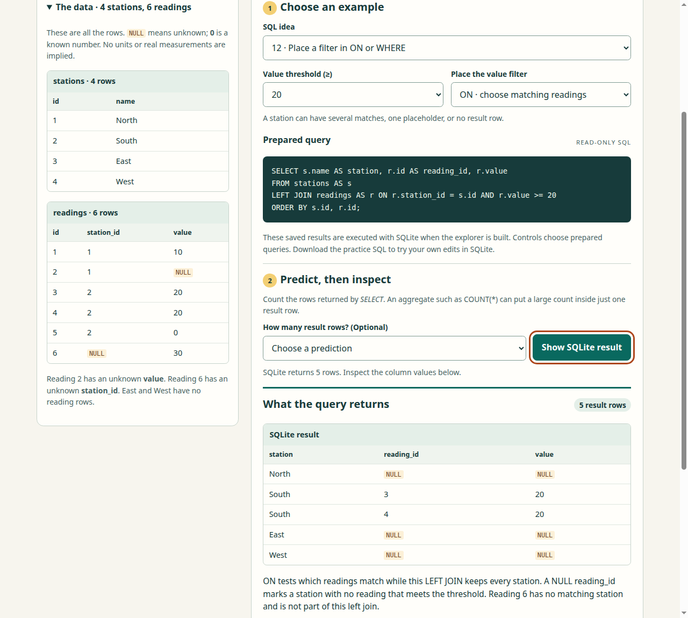
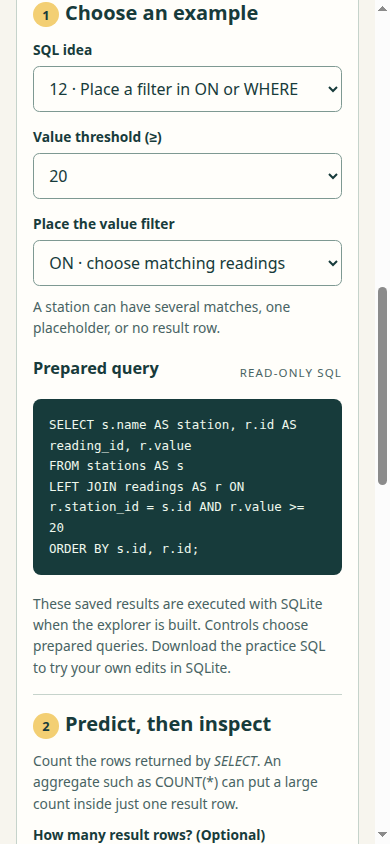
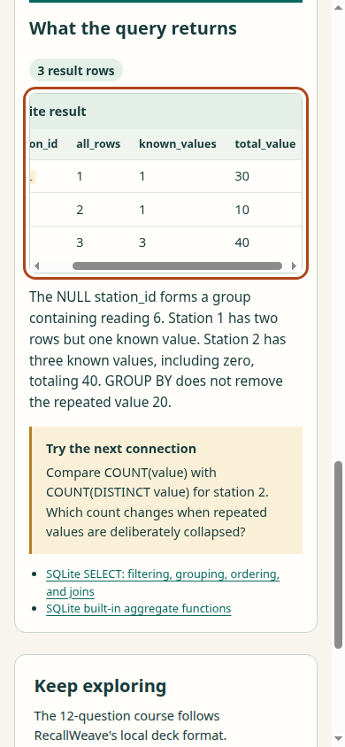

# SQL rows, NULLs, aggregates, and joins

An optional original course and a standalone explorer make the same small set of rows available for prediction, inspection, and practice. Save [sql-query-explorer.html](../../../courses/sql-query-explorer.html) and open it directly in a browser. The [worked guide](../../../courses/sql-query-foundations.md) explains the examples and maintenance commands.

The page contains four fictional stations and six readings. Its twelve examples expose twenty-two prepared query variants, including threshold changes and moving a left-join predicate between `WHERE` and `ON`. Learners can predict the number of result rows, reveal the exact SQL result, read the explanation, and explicitly download the complete course or practice SQL. Every displayed result was obtained from the exact query with SQLite during generation. The SQL field is read-only; the downloaded practice file is intended for a new empty SQLite database.

## Source and receiving

The exact [source manifest](source-pins.json) has SHA-256 `bf206f0e57730ef563b40d041e38dc24f587885e888ac55d64581c9d11b58f69`. It pins eight new contribution files and five unchanged published dependencies. This source was received against main `4775af91ba6a5d4df787669f39b44364dd1e37ba`; publication preparation then verified that all five dependencies remained byte-identical on main `d22b5ef7c641fc1726ae5b774383f8e6527d73e7`. All 336 leaves and modes of the current receiving base are preserved.

| Boundary | Actual evidence |
|---|---|
| SQLite truth and generated artifacts | Existing Mac Python 3.13.7 / SQLite 3.50.4 executed all twenty-two queries; saved artifacts matched the deterministic build. |
| Native RecallWeave contracts | Existing Mac Node 26.3.0 passed all five focused tests, with zero failures or skips, through the published validator, adaptive selector, answer ordering, immutable review, practice, and study-note functions. Invalid answers/queries and stale artifacts were refused without replacing existing files. |
| Independent SQL semantics | Six distinct SQLite controls examined NULL versus zero, empty versus all-NULL aggregates, three meanings of a left-join count, and `ON` versus `WHERE` at threshold 30. The independent packet and disposition are preserved separately. |
| Actual browser and saved-file use | Existing ThinkPad Chromium 153.0.8010.47 / Node 22.22.1 passed eight groups, exited normally with both required markers, preserved all thirteen source inputs, and removed its own temporary profile. |

The actual browser groups compare every query's SQL, columns, rows, and explanation; exercise correct/wrong predictions and reset behavior; use native keyboard input; complete and verify both download types; receive the 390-pixel layout and keyboard table scrolling; then close the loopback server and open a fresh direct-file page. No external page request or uncaught JavaScript exception occurred.

The two course downloads were byte-identical to `courses/sql-query-foundations.json`, SHA-256 `e5fbe1589409876871d1358e6287eb95d2cdd624a5d8da1e1a0a2871801f4512`. The downloaded practice SQL has SHA-256 `3492d499667aab3d2935f45adf7979b11e25bac30a36e6d79031c78b5ad2bbb8`.

## Inspect the retained evidence

- [Author evidence](author-evidence.tar.gz), SHA-256 `836231e75c7326e9a52a1d92c31bdfbb16d6ccb8c00961160967cd7332ab6481`, contains the exact native controllers, raw outputs, receipts, downloaded bytes, source manifests, screenshots, and prior receiver versions. Its archive manifest covers every payload, and all files were read back exactly after packing.
- [Independent evidence](independent-evidence.tar.gz), SHA-256 `b27d21fddf4bf95a93c20b5b44c22fc95cd76a044aa080c7718a2d4ae0a5d2ae`, and the verbatim [independent disposition](independent-review.md) retain the separate content, source, and receiving review. The nine-file archive preserves the original reviewer manifest `7ef08c9edff24a3a221d84bdac27dfff0f149a4a6d8d53aee28f3d46fce73594` and every original byte. The exact V3 standalone contribution is approved; issue 7 remains pending.
- `author/RECEIVING.md` inside the author archive distinguishes every earlier failure from final acceptance. Mac display navigation and a minimal runtime control did not receive the product. An early ThinkPad launch timed out. A later run passed all eight product groups but failed profile cleanup and exited 1; it remains unsuccessful. The final receiver corrected only startup/owned-process cleanup handling and passed normally. Disk-full and controller-copy failures are retained separately.

These frames come from the final accepted browser run:

The third frame was captured after an actual right-arrow scroll inside the result table. Its leading column is intentionally partly outside that scroll region; full result columns and values were separately compared exactly, and the document itself did not overflow.

## Ownership and limits

Source scope is [issue 22](https://github.com/Jacob-Met/RecallWeave/issues/22). The app, importer, authoring source, default course, model, and other owners' courses are preserved. The explorer uses an isolated finite query catalog, with no account, automatic storage, external data, or network service.

The actual current-main course-picker composition remains with [issue 7](https://github.com/Jacob-Met/RecallWeave/issues/7). Published schema and native module acceptance do not establish adoption through that unfinished importer. This contribution provides a directly usable standalone teaching page and valid optional course content. It makes no claim of importer adoption, deployment, or measured learning effectiveness.
