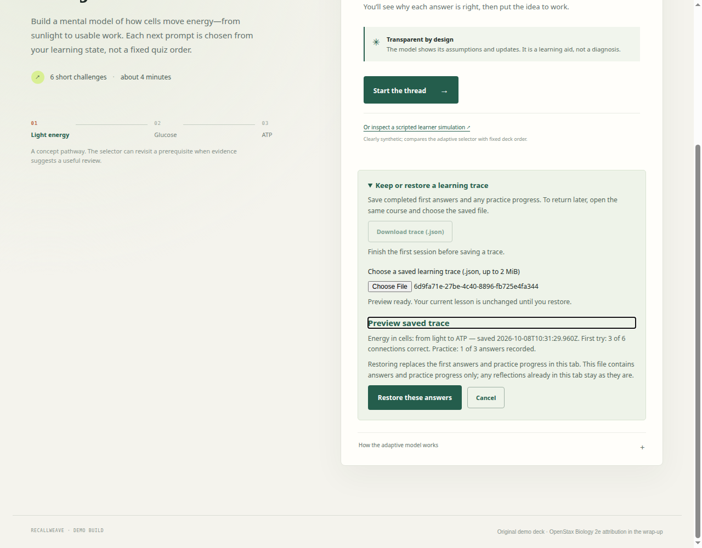
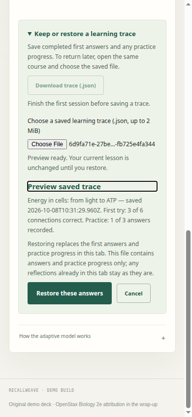

# Completed learning trace archives

Worker: `estate-49f845d0dece/source_coordination`
Issue: [#11](https://github.com/Jacob-Met/RecallWeave/issues/11)
Qualified integration base: `a64369f84fae4cfd0b81aa3878cc11e2fa8d298c`
Base tree: `83cca184222b9b16e0d0100bb2c43bd02951c87c`

## Learner outcome

A learner can explicitly download a completed first-answer trace and recorded practice progress, close the page, then choose that file in a fresh document. The preview identifies the course, save time, first-answer result and practice count. Confirmation restores those answers; the learning trace offers the next unanswered practice item.

The default application still keeps active state in memory. The archive is an explicit local file, with no account, upload, background save or browser storage. Readable study notes remain a separate existing download.

## Implementation and owner boundaries

`src/trace-archive.mjs` compares the archived deck with the already loaded course, requiring the same content while ignoring object-property order. It never admits a new course or uses archived question markup for rendering. The existing `createReview`, `updateMastery`, `beginPractice` and `answerPractice` functions reconstruct immutable first-answer and practice state. Stored first-session mastery must equal the replayed values at full precision.

Version 1 requires a completed first session, each known item exactly once, canonical choice indices, the current model identity/parameters, and a bounded practice prefix in missed-item order. Unknown fields, malformed data, incompatible versions and files over 2 MiB are refused. Practice remains separate and cannot rewrite initial answers or estimates.

`src/trace-archive-ui.mjs` exposes one `mountTraceArchive({container, getDeck, getTrace, restoreTrace})` seam. Reading and preview never call the restoring callback. Generation tickets discard older reads; a deck/answer/mastery/practice snapshot is checked after file reading and immediately before confirmation. The app calls `refresh()` when progress changes. Cancel, refusal and stale state keep the active lesson.

The application callback changes only first answers, asked IDs, mastery, review and practice, then renders the learning trace. It does not reset or replace reflection-owner state. Files do not contain reflections. Displayed option order comes from the current local session; archived choices retain their canonical identity under the now-merged answer presentation feature.

The additive application, index, scoped CSS and existing demo-builder hooks preserve merged #12. Existing answer-order, study-notes, knowledge and review modules are unchanged. Deck admission (#7), authoring (#10), course/content contributions, model/science changes and reflection export fields remain with their owners.

## Native qualification

| Check | Result |
|---|---:|
| Final native Node v22.22.1 test suite on ThinkPad | 31 pass, 0 fail |
| Same-byte standalone rebuild | Passed |
| Real Chromium 153.0.8010.47 browser receiver | 12 pass, 0 fail |
| Independent Node v26.3.0 codec and controller receiving | Accepted |

[Native suite](native-suite.json) contains the command, output and final source digests. [Browser report](browser/browser-report.json) contains browser identity, source digests, actual download digests and all 12 checkpoints. The reusable receiver is `tools/check_trace_browser.mjs`.

The browser receiver uses a separate temporary profile and a loopback server. It closes each tested document before restoring in a fresh target. It reads the browser's actual completed downloads and validates the saved bytes, then restores and downloads again to prove that canonical first choices, unrounded mastery and paused practice survive exactly. All saved examples here come from scripted synthetic lesson answers.

Covered browser boundaries:

- Preview and cancel preserve the fresh current lesson; local file selection causes no request.
- Corrupt JSON and an altered course with injected markup are refused without applying any archived state or markup.
- An answer after preview or during a held file read survives; stale restoration is unavailable.
- A slower earlier file read cannot replace the newer selection.
- Restored practice starts at the next unanswered item and finishes its single bounded round while the first answers and estimates stay unchanged.
- Download preparation failure preserves the current lesson and a later download succeeds.
- A file downloaded from the modular app restores in the direct-open standalone demo at 390px, with no hosted requests or horizontal overflow.

[Independent review](independent-review.md) and its [exact captured output](independent-review.json) cover adversarial course changes, late practice replay failure, older-read/newer-preview ordering, repeated confirmation, and changed state even without a refresh notification. The final source addendum checks the three-line selected-filename fix and the exact current-main composition; earlier evidence retains its original pins.

## Source custody and receiving history

The initial 15-file native snapshot was verified by Git blob against main `3e3217959bdf277ae5ef61a7afe68142e2626486`; see [initial custody](initial-source-custody.json). Native baseline commit `c0ebbb3c99b5e00f4f8b2895c3c0ddfd61abc244` and first reviewed candidate `7506eb005eb17d8472d359602ed0f103917e2fdf` preserve that small source subset. They are receiving commits, not full upstream repository mirrors.

Main advanced through merged #12 during implementation. [Current-main composition](current-main-composition.json) records its exact incoming blobs and the first composed source. The final pin table below supersedes its earlier UI/demo digests: visual inspection found that the native file input showed no selection during preview. The final three-line change retains the selected filename until cancel, refusal, invalidation or confirmation. The complete browser receiver then passed again on those final bytes.

The final whitespace gate also removed one extra terminal line feed from the composed app; [the custody mapping](final-whitespace-custody.json) records the before/after pins. The final native 31-test suite, complete 12-checkpoint browser receiver and same-byte rebuild passed again on the published source bytes.

An initial [Mac Chrome attempt](mac-browser-attempt.json) reached Chrome 154 CDP, then timed out at `Page.navigate` with native display-link errors before any browser checkpoint. It is retained as a failed attempt and is not counted as application qualification. The successful actual-browser receipt is from the existing ThinkPad Chromium environment. No shared application or service was changed.

## Final production pins

| File | SHA-256 |
|---|---|
| `index.html` | `4952ff7cc12696e6cc96e24645b5c9a3eea90b5102da4aacab637dca7526bcbe` |
| `demo.html` | `fc1e1526d4291ec840bb28c3dffea98368423c185485d4fa702cbb9db0afbdaf` |
| `styles.css` | `0496b0a343de70d3f3aa4c1ac176276eae5b40a21803aca4cf0b33f743db4195` |
| `tests/trace-archive.test.mjs` | `0eccb0565527f78266961796b0faf2d28585a530533b778a956069bcc5c96b27` |
| `src/trace-archive.mjs` | `d9e6d4343563eac97a17f0e79ea9080d0cfe694fd74f5e0173b53a4af3d912c6` |
| `src/trace-archive-ui.mjs` | `c62d7d40460ca20e47dba22a4401aff6aa2afbb0c9b873a94944d140c5fba28e` |
| `src/app.mjs` | `76edd6a454ebe20680f4a7b8c4b183f093f29ffa2e5091cd88da7db8d9a695d2` |
| `tools/make_demo.py` | `8fae60c5f98bc470d9ec8fe7ddacb00b644a0acfbeba8d10885da0daaa4417fc` |
| `tools/check_trace_browser.mjs` | `c325918f39bf2ea30e25c79347a15b362572919234cf9ef8fb17a091fd566e76` |

## Repeat the focused receiving

```bash
node --test tests/*.test.mjs
python3 tools/make_demo.py
node tools/check_trace_browser.mjs --browser /path/to/chromium --output /tmp/recallweave-trace-check
```

The optional browser receiver requires Node 22+ and an already installed Chrome/Chromium. The app and default test suite remain dependency-free.





## Integration continuation

Review the focused source delta and final source pins, preserve all incoming main paths, then integrate through the normal PR and Node/demo synchronization check. The deck importer is still owned separately; compose its final course getter and session lifecycle with the existing callback seam when that contribution is ready. This archive does not add deck admission or restore an unfinished first lesson.
