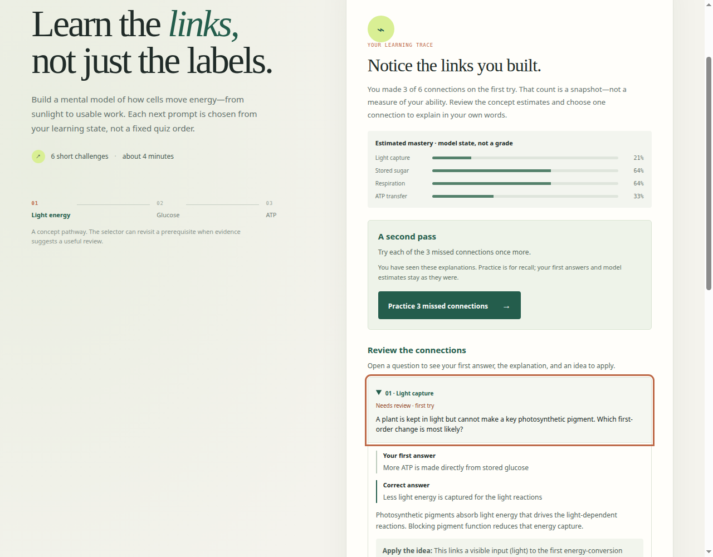
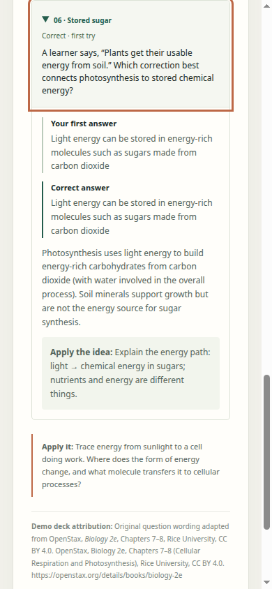

# Review and practice verification

RecallWeave now keeps completed questions available for review and offers one retry per initially missed connection. First answers, original mastery estimates, and retry answers remain distinct. The receiving source is the existing RecallWeave product; its deck, question wording, knowledge model, and simulation were preserved.

## Source

- GitHub base: `476a8889d14d38dbb83818dada44563cad76c1da`, tree `2d79671e73566a599e123fab0afb79409d03e505`.
- All 12 original files were materialized and verified against their Git blob identities before editing. The complete tree contained no `AGENTS.md`; current ownership was coordinated in [issue #3](https://github.com/Jacob-Met/RecallWeave/issues/3).
- Frozen local implementation: `38e128905cc76e9ac75cb3de0b6f34d99792b5ea`. This is a local source identity, not a GitHub receiving or deployment commit.
- [Verification data](verification.json) records the SHA-256 identities of the exact app, review model, unchanged knowledge/deck files, generated demo, styles, and browser runner.

## Observed behavior

The same real browser driver completed a mixed first-attempt session against the original and the candidate. Both produced **3 of 6** correct and the same estimates: Light capture **21%**, Stored sugar **64%**, Respiration **64%**, ATP transfer **33%**. The original then failed the review acceptance check with **0 review panels instead of 6**; focus fell back to the document body. The candidate exposes all six questions and focuses the result heading.

The candidate passed eight rendered checkpoints in Chromium 153.0.8010.47, driven through native CDP Enter and Tab events:

1. The modular lesson retains the original model results and makes every first answer reviewable.
2. Keyboard users can open a question and read the exact chosen option and correct answer.
3. Leaving practice after an answer retains that retry and the original estimates.
4. Leaving before an answer resumes the same unanswered question.
5. A three-question practice round records two correct retries and one incorrect retry without changing the first-attempt score, status labels, or estimates. The round ends after one retry per missed question.
6. An all-correct session still offers all six review panels; a 390px viewport has no horizontal overflow, including an expanded explanation.
7. The direct-open `demo.html` completes a six-question review and practice round, changing its separate retry result from zero recorded retries to six correct retries while retaining the original zero-of-six first-attempt record. That page requested no hosted resource.
8. No JavaScript exception occurred on those rendered paths.

The local Node 24.19.0 suite passed **14 tests**, comprising seven inherited knowledge checks and seven new review/practice checks, with no failures or skips. Regenerating the standalone HTML was deterministic; the bundled script passed Node's syntax check. The runner's exact transferred bytes were read back after execution.

## Captures

The captures were inspected at 1280 × 1000 and 390 × 844. They show the keyboard focus indicator, retained first answer, correction, and transfer prompt with the existing visual design.

## Execution history and limits

The first two browser attempts failed before reaching a product checkpoint because the initial CDP helper omitted the carriage-return text required to activate the focused button with Enter. Adding a readiness wait preserved the same refusal. Correcting the keyboard event made the unchanged app pass; those earlier failures are recorded in the verification data, and their original diagnostic reports were retained in the contribution workspace.

The installed browser ran with a temporary profile and a temporary localhost server. The runner closed its browser and removed its own profile. These are headless Chrome and viewport checks, not physical-phone, screen-reader, or learning-efficacy evidence. No deployment, contest submission, account connection, or storage behavior changed.
